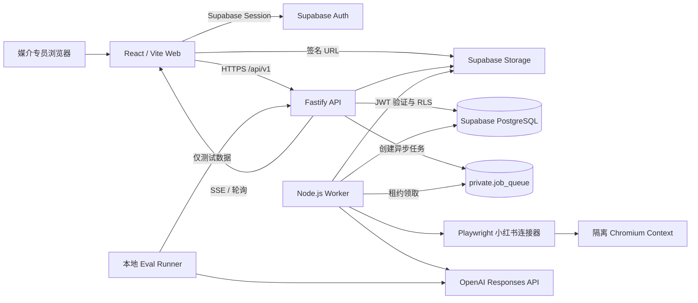
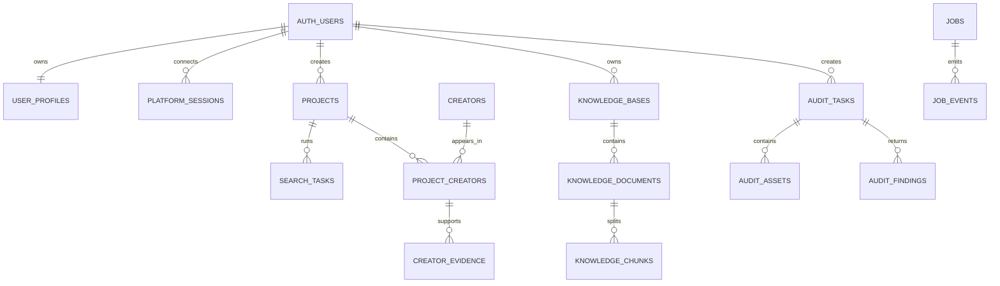

# 媒介助手 MVP 技术方案 v1

> 文档状态：已确认，当前有效  
> 版本：v1.0  
> 日期：2026-08-15  
> 产品基线：`媒介助手_MVP_PRD.md`  
> UI 基线：Figma `媒介助手｜高保真原型 / Core Screens`  
> 适用范围：一周 MVP 的开发与验证，不代表小红书官方授权或生产级可用性承诺

## 1. 结论摘要

MVP 保留现有 React/Vite/TypeScript 前端，新增 Fastify/TypeScript API、Supabase 和独立 Node.js Worker。同步请求由 API 处理；小红书扫码、页面采集、知识库解析和 AI 分析由 Worker 异步处理。

技术阶段必须先验证“小红书扫码登录 → 会话可用 → 搜索结果页读取 → 单个达人主页读取”的真实链路。只有 PoC 通过后，才继续扩大达人筛选功能；PoC 失败时保留错误证据和限制结论，不以静态或伪造数据替代。

系统中的 AI 能力拆为五条可测试 Workflow：

1. 自然语言筛选规则解析。
2. 达人搜索、硬条件过滤和语义分析。
3. 私有知识库文档解析与入库。
4. 图文内容合规辅助审核。
5. 只在本地运行的 Eval 与用量评估。

模型主选 `gpt-5.6-sol`，通过 OpenAI Responses API 调用。官方模型文档确认其支持文本输入输出、图片输入、流式响应、函数调用和结构化输出，因此可用于规则解析、达人内容语义判断和首版图片文字抽取。但 OCR 准确率、中文广告审核质量与费用仍必须通过本地 Eval 验证。[GPT-5.6 Sol model documentation](https://developers.openai.com/api/docs/models/gpt-5.6-sol)

## 2. 目标与非目标

### 2.1 技术目标

- 支持多个人账号注册、登录及按 `user_id` 隔离数据。
- 支持小红书扫码连接，并对连接、过期、风控和失败状态可诊断。
- 支持用户输入自然语言规则，默认返回最多 50 个不重复候选达人。
- 支持候选达人待定、选入、弃用、分组、标签、状态互转和 Excel 导出。
- 支持公共《中华人民共和国广告法》知识库与用户私有知识库。
- 支持标题、正文和图片组成的图文内容审核，输出风险、依据、建议和不确定性。
- 支持本地 Eval、人工标注、模型/Prompt 对比和 token/费用记录。
- 形成可由 OpenAPI 契约、数据库迁移和自动化测试验证的实现边界。

### 2.2 本期非目标

- 不支持抖音、快手、微博等其他平台。
- 不支持视频内容审核。
- 不支持组织、团队、角色和企业级权限。
- 不承诺绕过小红书验证码、风控、频控或访问限制。
- 不把本地 Eval、token 或费用后台部署到对外系统。
- 不提供法律意见；审核结果只作为人工复核辅助。
- 不在 MVP 引入微服务集群、Kafka、Kubernetes 或复杂的数据仓库。

## 3. 决策状态

### 3.1 已确认决策

| 编号 | 决策 |
| --- | --- |
| A01 | 前端沿用 React + Vite + TypeScript，不迁移 Next.js。 |
| A02 | API 使用 Fastify + TypeScript；耗时任务由独立 Worker 执行。 |
| A03 | 新建 Supabase 项目，使用 Auth、PostgreSQL、Storage 和 pgvector。 |
| A04 | 先在本地跑通全链路，云服务器和部署预算后续单独确认。 |
| A05 | 小红书链路按“可诊断但允许失败”的 PoC 推进，禁止用模拟数据冒充成功。 |
| A06 | 实现顺序为账号与隔离 → 扫码 PoC → 单达人真实读取 → 搜索与 AI → 审核。 |
| A07 | 多个人账号，所有业务数据绑定 `user_id`；MVP 不做组织和角色。 |
| A08 | 公共知识库只内置广告法，其他规则由用户上传私有知识库。 |
| A09 | 图文审核优先；本地 Eval 与用量记录不进入线上产品。 |

### 3.2 已确认实现参数

以下实现参数已于 2026-08-15 随技术方案一并确认：

| 编号 | 默认值 | 调整影响 |
| --- | --- | --- |
| Q01 | Supabase 邮箱 + 密码注册登录 | 若改为验证码登录，需要邮件服务和限流策略。 |
| Q02 | Worker 控制隔离的 Chromium 浏览器完成小红书扫码 | 若改为浏览器扩展或本机代理，采集架构需重做。 |
| Q03 | 前端仅持有 Supabase anon key 和用户 Session；service role 仅限服务端 | 属于安全底线，不建议放宽。 |
| Q04 | 每个用户同时最多 1 个搜索、1 个审核、1 个知识库解析任务；Worker 全局并发 3 | 会影响机器规格、速度和成本。 |
| Q05 | 状态更新使用 SSE，断线后每 3 秒轮询兜底 | 可改为纯轮询，开发更简单但实时性较差。 |
| Q06 | 图文审核最多 9 张 JPG/PNG 图片，每张 10 MB | 调整会影响上传、推理成本和超时。 |
| Q07 | 单个知识库文档支持 PDF/DOCX/TXT/MD，最大 20 MB；每个知识库最多 20 个文档 | 调整会影响解析器和存储预算。 |
| Q08 | API 契约使用 OpenAPI 3.1，运行时 Schema 使用 Zod | 若更换契约工具，需要同步调整前端类型生成。 |

## 4. 总体架构



### 4.1 分层职责

| 层 | 职责 | 不负责 |
| --- | --- | --- |
| Web | 页面、表单、任务状态、结果操作、上传、导出触发 | 不保存平台 Cookie，不直连 OpenAI，不执行采集 |
| Fastify API | 鉴权、授权、参数验证、同步 CRUD、签名 URL、任务创建、SSE | 不在 HTTP 请求内运行长时间浏览器或 AI 流程 |
| Worker | 浏览器会话、采集、解析、向量化、AI 分析、任务重试 | 不直接向公网暴露管理端口 |
| Supabase | Auth、PostgreSQL、RLS、Storage、pgvector | 不代替业务层校验和 Worker 幂等控制 |
| 本地 Eval | 数据集、标注、批量运行、指标和费用分析 | 不部署为线上页面或 API |

### 4.2 为什么采用该架构

- 现有前端已经完成首轮实现，迁移框架只会消耗一周 MVP 时间。
- 浏览器采集和 AI 调用耗时且可能中断，独立 Worker 能避免阻塞 API 并保留可诊断状态。
- Supabase 同时提供 Auth、RLS、数据库和对象存储，适合单人开发阶段减少基础设施数量。
- MVP 使用 PostgreSQL 任务表，不额外引入 Redis/BullMQ；达到明显吞吐瓶颈后再评估消息队列。
- 小红书连接器与业务逻辑隔离，便于在平台页面变化或 PoC 失败时替换实现，而不污染项目、达人和审核数据模型。

## 5. 建议代码结构

保留当前前端目录，新增后端和共享包：

```text
/
├─ src/                         # 当前 React Web
├─ server/
│  └─ src/
│     ├─ routes/                # /api/v1 路由
│     ├─ modules/               # auth/projects/search/audit/kb
│     ├─ schemas/               # Zod 请求与响应 Schema
│     ├─ services/              # Supabase/OpenAI/Storage
│     └─ plugins/               # auth、error、request-id、SSE
├─ worker/
│  └─ src/
│     ├─ jobs/                  # 任务处理器
│     ├─ connectors/xhs/        # 小红书 Playwright 适配器
│     ├─ workflows/             # AI Workflow
│     └─ parsers/               # PDF/DOCX/TXT/MD
├─ packages/
│  └─ shared/                   # DTO、枚举、Schema、错误码
├─ supabase/
│  ├─ migrations/               # 数据库、RLS、索引
│  └─ seed/                     # 非敏感开发种子，不含真实账号数据
├─ local-eval/                  # 不参与线上部署
│  ├─ datasets/
│  ├─ labels/
│  ├─ runners/
│  ├─ reports/
│  └─ README.md
└─ docs/project-docs/           # 产品与工程资料
```

## 6. 身份认证与数据隔离

### 6.1 登录流程

1. Web 使用 Supabase Auth 完成注册和登录。
2. Web 只保存 Supabase 用户 Session，并携带 `Authorization: Bearer <access_token>` 调用 API。
3. Fastify 通过 Supabase JWKS 验证 JWT，不接受前端传入的 `user_id` 作为权限依据。
4. API 从已验证 Token 的 `sub` 得到 `user_id`，写入请求上下文。
5. 普通数据访问优先使用用户 JWT 连接 Supabase，让 RLS 生效。

### 6.2 RLS 原则

- 所有用户私有表必须包含 `user_id`，并启用 RLS。
- 查询、更新、删除策略均以 `user_id = auth.uid()` 为基础。
- 公共广告法内容只允许认证用户读取，不允许普通用户修改。
- service role 只存在 API/Worker 环境中，用于任务租约、系统知识库导入等必要操作。
- Worker 使用 service role 时必须显式携带任务所属 `user_id`，并在领取任务、读取输入、写入结果三处校验所有权。
- `private` Schema 中的任务队列表不通过浏览器端 PostgREST 暴露。

### 6.3 越权验证

自动化测试至少创建用户 A、用户 B，并验证：

- A 无法读取、修改、导出或订阅 B 的项目、达人、知识库、审核和任务事件。
- 修改 URL 中的资源 ID 不能绕过授权。
- 签名下载 URL 只能由资源所有者请求，且短时有效。
- Worker 不会把 A 的任务结果写入 B 的资源。

## 7. 核心数据模型

### 7.1 关系概览



### 7.2 主要表

| 表 | 关键字段 | 约束或说明 |
| --- | --- | --- |
| `user_profiles` | `user_id`, `display_name`, `created_at` | `user_id` 对应 `auth.users.id` |
| `platform_sessions` | `id`, `user_id`, `platform`, `status`, `encrypted_state`, `expires_at`, `last_verified_at` | 每用户小红书有效连接最多 1 个；敏感状态加密 |
| `projects` | `id`, `user_id`, `name`, `product_name`, `status` | 推广项目与自定义分组的上层容器 |
| `search_tasks` | `id`, `user_id`, `project_id`, `query_text`, `parsed_rule_json`, `status`, `limit`, `progress`, `error_code` | 默认 `limit=50`；保存 Schema/Prompt/模型版本 |
| `creators` | `id`, `platform`, `platform_creator_id`, `nickname`, `profile_url`, `latest_snapshot_json` | 全局唯一 `(platform, platform_creator_id)` |
| `project_creators` | `id`, `user_id`, `project_id`, `creator_id`, `decision_status`, `group_id`, `match_score`, `analysis_json` | 唯一 `(project_id, creator_id)`；`group_id` 外键指向项目分组 |
| `creator_evidence` | `id`, `project_creator_id`, `evidence_type`, `source_url`, `excerpt`, `captured_at` | 记录匹配理由和证据，不保存模型思维过程 |
| `creator_tags` | `id`, `user_id`, `project_creator_id`, `tag` | 唯一 `(project_creator_id, tag)` |
| `knowledge_bases` | `id`, `user_id`, `scope`, `name`, `status`, `version` | `scope=public_law/private`；公共库 `user_id` 可空 |
| `knowledge_documents` | `id`, `user_id`, `kb_id`, `file_path`, `mime_type`, `checksum`, `status`, `version` | 同一知识库按 checksum 去重 |
| `knowledge_chunks` | `id`, `document_id`, `chunk_index`, `content`, `source_locator`, `embedding` | `source_locator` 保存法规条款或文档页码 |
| `audit_tasks` | `id`, `user_id`, `title`, `body`, `requirements`, `status`, `result`, `overall_risk`, `kb_snapshot_json` | 保存审核时知识库版本快照 |
| `audit_assets` | `id`, `user_id`, `audit_task_id`, `storage_path`, `mime_type`, `sort_order`, `extract_status`, `extracted_text` | 私有对象存储，最多 9 张图 |
| `audit_findings` | `id`, `audit_task_id`, `risk_level`, `category`, `quote`, `source_chunk_id`, `explanation`, `suggestion` | `source_chunk_id` 必须来自本次检索集 |
| `private.jobs` | `id`, `user_id`, `type`, `status`, `payload`, `attempts`, `run_after`, `locked_by`, `lock_expires_at`, `idempotency_key` | 不对前端开放；唯一幂等键 |
| `private.job_events` | `id`, `job_id`, `seq`, `event_type`, `data`, `created_at` | 为 SSE、排错和轮询提供事件流 |

### 7.3 数据快照与可追溯性

- 达人列表展示的是最近一次采集快照，并明确 `captured_at`，避免把历史数据表述为当前实时数据。
- 搜索任务保存原始规则、确认后的结构化规则、模型、Prompt 和 Schema 版本。
- 审核任务保存所使用的公共法规版本、私有知识库文档版本和检索片段 ID。
- AI 输出只保存结论、置信度、证据和警告，不保存内部推理过程。

## 8. 文件与对象存储

建议使用三个私有 Bucket：

| Bucket | 内容 | 生命周期 |
| --- | --- | --- |
| `audit-assets` | 用户上传的图文审核图片 | 由用户删除或按后续保留策略清理 |
| `knowledge-documents` | 私有知识库原始文档 | 跟随知识库生命周期 |
| `ephemeral-qr` | 小红书二维码截图 | 最长 2 分钟，优先内存传输；不得进入日志 |

上传流程：API 校验所有权和文件声明 → 生成短时签名上传 URL → Web 直传 Storage → API/Worker 再检查实际 MIME、扩展名、大小与图片可解码性 → 标记可处理。

任何对象路径都包含不可猜测 ID，不使用用户提供的文件名作为真实路径。下载和预览使用短时签名 URL。

## 9. 异步任务与状态同步

### 9.1 任务队列

MVP 使用 PostgreSQL `private.jobs`：

1. API 在创建业务记录的同一事务中插入 Job。
2. Worker 通过 `FOR UPDATE SKIP LOCKED` 领取到期 Job，写入 Worker ID 和租约到期时间。
3. Worker 运行时定期续租；异常退出后由其他 Worker 在租约过期后重新领取。
4. 每个处理器必须基于业务主键和 `idempotency_key` 幂等写入。
5. 短暂网络和 5xx 错误最多重试 2 次，使用指数退避和随机抖动。
6. 验证码、账号过期、平台频控或明确业务错误不得盲目重试。

### 9.2 并发限制

默认每个用户同时最多运行：

- 1 个达人搜索任务。
- 1 个内容审核任务。
- 1 个知识库解析任务。

单个本地 Worker 默认总并发 3。浏览器采集任务和 AI 任务使用独立信号量，避免多个 Chromium Context 抢占内存。

### 9.3 前端进度

- 首选 `GET /api/v1/tasks/{taskId}/events` 的 SSE。
- 事件至少包含 `seq`、`task_id`、`status`、`progress`、`message_code`、`occurred_at`。
- 浏览器断线后携带最后 `seq` 重连；SSE 不可用时每 3 秒轮询任务详情。
- 文案由前端根据 `message_code` 映射，后端日志详情不直接暴露给用户。

## 10. 小红书扫码与真实数据 PoC

### 10.1 目标

验证以下最小闭环是否能在当前环境、当前账号和平台限制下真实运行：

```text
创建连接 → 获取二维码 → 用户扫码 → 识别登录成功
→ 打开一个搜索结果页 → 读取候选卡片
→ 打开一个达人主页 → 读取公开资料和公开内容摘要
```

### 10.2 实现边界

- Worker 为每个用户连接创建独立的 Chromium Browser Context。
- 二维码是平台页面产生的短时画面，由 API 转为短时访问资源；不允许用户上传 Cookie 代替扫码。
- 登录成功后，将必要的 Browser Storage State 使用 AES-256-GCM 在应用层加密后保存。
- 加密密钥只从 Worker 环境变量读取，不写入数据库、文档、前端或日志。
- 前端永远不获得小红书 Cookie、Token 或 Storage State。
- 每次任务开始前先做轻量会话验证，发现过期即转为 `session_expired` 并要求重新扫码。
- 不实现验证码破解、风控绕过、设备指纹伪造或无限重试。

### 10.3 连接状态机

```text
disconnected
  → qr_pending
  → qr_scanned
  → connected
  → expired | restricted | failed
```

状态说明：

- `qr_pending`：二维码可用，等待扫码。
- `qr_scanned`：平台已检测扫码，等待手机确认或页面跳转。
- `connected`：已通过最小会话验证。
- `expired`：二维码或已保存会话过期。
- `restricted`：出现验证码、频控或平台访问限制，不自动绕过。
- `failed`：浏览器启动、页面结构或网络导致的不可恢复错误。

### 10.4 采集适配器

`XhsConnector` 仅向业务层暴露稳定接口：

```ts
interface XhsConnector {
  createQrSession(userId: string): Promise<QrSession>;
  verifySession(sessionId: string): Promise<SessionState>;
  searchCreators(input: XhsSearchInput): AsyncIterable<RawCreatorCandidate>;
  getCreatorProfile(platformCreatorId: string): Promise<RawCreatorProfile>;
}
```

选择器、页面等待、网络响应解析和字段映射都封装在连接器内部。每个采集字段必须带来源、采集时间和解析方式，页面变化时可以定位失败点。

### 10.5 PoC 验收门

| 结果 | 条件 | 后续 |
| --- | --- | --- |
| 通过 | 可重复完成扫码、搜索页读取和单达人主页读取；字段与页面人工核对一致 | 继续批量搜索、去重和 AI 分析 |
| 部分通过 | 扫码成功，但搜索或主页字段不稳定、频控明显 | 先限定字段、频率和使用范围，再由用户决定是否继续 |
| 失败 | 无法稳定保持会话、必须绕过安全机制，或真实数据不可合法/可靠获取 | 停止该链路；交付错误证据、限制与替代方案，不接入假数据 |

### 10.6 PoC 证据

验收证据放入任务包 `验收证据/`，应包含运行时间、环境、脱敏截图、状态事件、字段对照和失败分类。不得保存二维码、Cookie、Token、账号标识或可复用会话信息。

## 11. AI Workflow 设计原则

- AI 只处理语言和图片语义判断；唯一性、阈值、权限、状态、排序和总风险合成尽量由确定性代码执行。
- 所有线上 AI 输出必须使用版本化 JSON Schema，并经 Zod 二次校验。
- 输出不合 Schema 时最多执行一次“只修复格式”的重试；仍失败则进入可诊断失败状态。
- 任何判断都返回依据片段或 `insufficient_evidence`，不允许编造来源。
- 保存模型名、Prompt 版本、Schema 版本、请求 ID、token 和耗时；不保存模型思维过程。
- 对用户展示“AI 辅助判断，需人工确认”，特别是达人经历和内容合规结论。

## 12. Workflow A｜自然语言筛选规则解析

### 12.1 输入

```json
{
  "query": "粉丝小于1500，活跃度较高，做过光子嫩肤或有晒斑困扰",
  "defaults": {
    "limit": 50,
    "platform": "xiaohongshu"
  }
}
```

### 12.2 处理流程

```text
文本长度与安全校验
→ 规则解析模型调用
→ JSON Schema 校验
→ 归一化同义词和单位
→ 区分硬条件、语义条件和排序偏好
→ 标记歧义及缺失字段
→ 返回给用户确认
→ 保存确认版本并启动搜索
```

### 12.3 结构化输出

```json
{
  "hard_filters": {
    "followers": { "operator": "lt", "value": 1500 }
  },
  "semantic_conditions": [
    {
      "type": "experience",
      "terms": ["光子嫩肤"],
      "match": "any"
    },
    {
      "type": "concern",
      "terms": ["晒斑"],
      "match": "any"
    }
  ],
  "ranking": [{ "field": "activity", "direction": "desc" }],
  "limit": 50,
  "ambiguities": ["活跃度较高尚未定义时间窗口和发帖频率"],
  "schema_version": "search-rule.v1"
}
```

模型不直接决定“活跃度较高”的数值。MVP 默认可解释计算为最近 30 天公开发布数、最近一次发布时间和近期互动中位数的组合；阈值应在本地 Eval 后固定。

## 13. Workflow B｜达人搜索与分析

### 13.1 分阶段流程

```text
验证小红书会话
→ 获取搜索页原始候选
→ 按 platform_creator_id 去重
→ 排除当前 project_id 已存在达人
→ 代码执行粉丝数等硬条件
→ 获取必要的达人主页和近期内容
→ 内容清洗、截断和证据编号
→ AI 判断项目经历/困扰等语义条件
→ 代码计算活跃度与匹配分
→ 保存候选、证据和采集时间
→ 达到 50 人或数据源耗尽后结束
```

### 13.2 唯一性与续搜

- 达人全局身份键：`platform + platform_creator_id`。
- 项目内不重复键：`project_id + creator_id`。
- 每次续搜先读取该项目已有达人 ID，并在落库使用唯一约束再次兜底。
- 用户标签不是达人身份的一部分；标签变化不应让同一达人重复出现。

### 13.3 AI 输入与输出

AI 只接收满足最小必要原则的公开内容摘要，例如：

```json
{
  "rule": { "semantic_conditions": [] },
  "creator": {
    "bio": "...",
    "recent_posts": [
      { "evidence_id": "p1", "title": "...", "text": "...", "published_at": "..." }
    ]
  }
}
```

输出：

```json
{
  "conditions": [
    {
      "condition_id": "c1",
      "verdict": "matched",
      "confidence": 0.86,
      "evidence_ids": ["p1"],
      "reason": "内容明确提及相关项目体验"
    }
  ],
  "warnings": [],
  "schema_version": "creator-semantic-match.v1"
}
```

`match_score` 由代码根据硬条件、语义命中、活跃度和证据充分度合成。模型不得自行返回最终排序分，以免同批结果尺度漂移。

### 13.4 搜索任务状态

```text
queued → validating_session → collecting → hard_filtering
→ analyzing → persisting → completed
                    ↘ partial | cancelled | session_expired | rate_limited | failed
```

若已获得部分真实候选后发生频控，任务可标记 `partial` 并保留已验证结果；前端必须明确显示未达到目标数量的原因。

## 14. Workflow C｜私有知识库入库

### 14.1 流程

```text
签名上传
→ MIME/大小/恶意文件基础校验
→ 文本解析
→ 清理页眉页脚和重复空白
→ 按标题/条款优先切块
→ 生成 source_locator
→ 计算 checksum 和版本
→ 生成向量
→ 写入 pgvector
→ 抽样可检索性检查
→ ready
```

### 14.2 切块策略

- 法规按“条”优先切分，不跨条混合；保存法规名称、版本、条款号和来源 URL。
- 私有文档优先按标题、段落、列表切分；建议 400–800 中文字，保留约 10% 上下文重叠。
- 表格解析失败或图片型 PDF 无可用文本时，状态转为 `needs_attention`，不静默生成空知识库。
- Embedding 模型通过配置管理，具体型号在中文检索 Eval 后确认，不在本方案中盲目锁定。

### 14.3 知识库状态

```text
uploaded → parsing → chunking → embedding → validating → ready
                                                ↘ needs_attention | cancelled | failed
```

更新文档生成新版本。已经完成的审核保留旧版本快照，不随知识库更新而改变历史结果。

知识库为 `needs_attention` 时，如果至少存在一份 `ready` 文档，可以由 `selectable=true` 表示允许使用成功子集，但审核结果必须提示覆盖不完整；没有任何 `ready` 文档时不可选择。

## 15. Workflow D｜图文内容合规辅助审核

### 15.1 输入

- 标题。
- 正文。
- 最多 9 张图片。
- 用户输入的审核要求或脚本。
- 公共广告法知识库。
- 用户勾选的一个或多个私有知识库。

### 15.2 处理流程

```text
输入与图片校验
→ 图片文字和画面要素抽取
→ 标题/正文/图片文字归一化并定位
→ 分别检索公共广告法与私有规则
→ 对检索结果做权限与版本校验
→ AI 输出风险项、原文定位、依据和修改建议
→ 代码校验所有引用确实来自本次检索片段
→ 代码合成 overall_risk
→ 保存知识库快照和结构化结果
→ 人工复核
```

### 15.3 图片处理

首版使用 `gpt-5.6-sol` 图片输入抽取可见文字和关键画面要素，输出坐标可选、文字内容、置信度和 `asset_id`。如果本地 Eval 证明小字、复杂排版或成本不达标，再替换为专用 OCR；上层审核 Schema 不变。

严禁仅依据低置信度 OCR 结果给出确定性高风险结论。低于 Eval 确定阈值时标记“图片文字可能识别不全，需人工核对”。

### 15.4 检索规则

- 公共广告法和私有规则分开检索，输出中明确 `source_scope`。
- 私有规则可以增加企业审查要求，但不能删除、覆盖或降低广告法风险。
- 每个依据必须包含 `chunk_id`、文档名称、版本、条款/页码和相关原文。
- 无充分依据时输出 `insufficient_evidence`，不能伪造法规条款。

### 15.5 结构化输出

```json
{
  "overall_risk": "high",
  "findings": [
    {
      "risk_level": "high",
      "category": "absolute_claim",
      "location": { "type": "body", "quote": "..." },
      "source": {
        "scope": "public_law",
        "chunk_id": "...",
        "document": "中华人民共和国广告法",
        "locator": "第X条"
      },
      "explanation": "...",
      "suggestion": "...",
      "confidence": 0.91
    }
  ],
  "coverage_warnings": [],
  "disclaimer": "AI辅助审核结果，不构成法律意见，需人工复核。",
  "schema_version": "content-audit.v1"
}
```

总风险由代码合成：存在任何有效 `high` 则为高风险；否则存在 `medium` 为中风险；否则若存在需人工确认项或关键覆盖不足则为 `needs_confirmation`；其余才为低风险。OCR 低置信度、抽取失败和输入截断进入独立 `coverage_warnings`，不伪造法规依据，也不把“未识别”当成“无风险”。

### 15.6 审核状态

```text
queued → validating → extracting → retrieving → analyzing → validating_result → completed
                         ↘ needs_attention              ↘ cancelled | failed
```

## 16. Workflow E｜本地 Eval 与人工标注

本地 Eval 位于 `/local-eval`，不参与线上构建和部署。

### 16.1 数据集

| 数据集 | 样本 | 人工标签 |
| --- | --- | --- |
| `rule_parse` | 用户自然语言筛选规则 | 硬条件、语义条件、歧义 |
| `creator_match` | 脱敏达人公开内容样本 | 每项条件是否命中、证据 ID |
| `image_extract` | 审核图片 | 文字真值、漏字和关键画面要素 |
| `audit_risk` | 图文内容 + 规则片段 | 风险等级、位置、依据、建议 |
| `retrieval` | 审核问题 + 知识库 | 相关 chunk 集合 |

测试数据在进入真实测试阶段再采集和标注；仓库不得提交小红书 Cookie、账号凭据和未经处理的敏感信息。

### 16.2 指标

- 规则解析：字段级 Precision/Recall、数值条件准确率、Schema 成功率。
- 达人匹配：条件级 Precision/Recall、证据准确率、人工接受率、Top-50 有效率。
- OCR/图片抽取：字符准确率、关键信息召回率、低置信度校准。
- RAG：Recall@K、引用命中率、无效引用率。
- 审核：高风险召回率、误报率、依据正确率、修改建议可用率。
- 工程指标：P50/P95 延迟、错误率、平均 token、单任务估算费用。

### 16.3 Eval 输出

每次运行生成机器可读 JSON 和本地 Markdown 报告，记录：

- 数据集版本和样本数。
- 模型、Reasoning、Prompt、Schema 和代码版本。
- 各指标、失败样本和人工复核差异。
- 输入/输出 token、缓存命中、估算费用和延迟。
- 是否达到进入下一阶段的门槛。

这些报告不得进入线上数据库或用户页面。

## 17. 模型、Prompt 与输出版本管理

### 17.1 模型策略

- 主模型：`gpt-5.6-sol`，通过环境变量 `OPENAI_MODEL` 配置。
- 调用方式：OpenAI Responses API。
- 规则解析和图片抽取先用低推理强度；语义匹配和合规审核先用中等推理强度，再由 Eval 调整。
- 不使用 ChatGPT Plus 额度承担系统调用；线上或本地服务端调用使用独立 OpenAI API 项目和预算。
- API Key 只存在服务端/Worker 环境，不进入 Web Bundle。

### 17.2 Prompt 版本

每个 Workflow 的 Prompt 作为代码资源版本化：

```text
workflow: content-audit
prompt_version: content-audit.zh-CN.v1
schema_version: content-audit.v1
model: gpt-5.6-sol
```

更换模型、Prompt 或 Schema 后必须运行对应 Eval。历史任务保留当时版本，避免新版本改变旧结果的解释。

### 17.3 成本控制

- 先执行确定性硬过滤，再调用 AI，减少无效候选。
- 达人近期内容只传与条件相关的有限窗口，避免整页无界输入。
- 对内容归一化结果、文档 chunk 和相同输入使用版本化缓存键。
- 超过单任务输入上限时分批处理并提示覆盖范围。
- 开发阶段由本地 Eval 报告费用；上线预算和限额在部署方案阶段单独确认。

## 18. API 设计约定

完整接口将在本方案确认后形成独立 OpenAPI 3.1 契约，本节只规定统一原则。

### 18.1 基础约定

- 基础路径：`/api/v1`。
- 鉴权：`Authorization: Bearer <Supabase access token>`。
- 请求和响应：JSON；文件使用签名上传，不把大文件经 Fastify 中转。
- 时间：ISO 8601 UTC。
- ID：UUID。
- 列表分页：游标分页，返回 `next_cursor`。
- 创建异步任务支持 `Idempotency-Key`。
- 每个响应带 `request_id`；异步资源另带 `task_id`。

成功响应：

```json
{
  "data": {},
  "meta": { "request_id": "..." }
}
```

错误响应：

```json
{
  "error": {
    "code": "XHS_SESSION_EXPIRED",
    "message": "小红书连接已过期，请重新扫码。",
    "retryable": false,
    "details": {}
  },
  "meta": { "request_id": "..." }
}
```

### 18.2 领域接口组

| 接口组 | 主要职责 |
| --- | --- |
| `/auth` | 仅补充用户资料；登录本身由 Supabase Auth 完成 |
| `/platform-connections` | 创建二维码、查询连接状态、断开连接 |
| `/projects` | 项目 CRUD、自定义分组 |
| `/search-tasks` | 规则解析、确认、启动、进度、取消、续搜 |
| `/creators` | 项目候选列表、选入/弃用、标签、详情、导出 |
| `/knowledge-bases` | 私有知识库、文档上传、解析状态、版本和删除 |
| `/audit-tasks` | 图文上传、启动审核、状态、结果和历史 |
| `/tasks` | 通用任务事件 SSE 与轮询 |

### 18.3 错误码分层

- `AUTH_*`：认证和权限。
- `VALIDATION_*`：请求、文件和 Schema。
- `XHS_*`：连接、会话、页面、频控和采集。
- `AI_*`：模型超时、输出格式、内容限制。
- `KB_*`：文档解析、向量化和检索。
- `TASK_*`：并发、取消、租约和幂等。
- `INTERNAL_*`：未分类服务端错误；不向前端泄露堆栈。

## 19. 安全与隐私

### 19.1 密钥和会话

- `OPENAI_API_KEY`、`SUPABASE_SERVICE_ROLE_KEY`、数据库连接串和会话加密密钥只通过环境变量或部署密钥服务注入。
- 不将 `.env`、Cookie、Token、二维码、验证码、证书或可复用 Session 写入 Git 或项目文档。
- 小红书 Storage State 使用 AES-256-GCM，随机 IV，每条记录独立认证标签。
- 断开小红书连接时删除加密会话；删除文件属于正式实现中的用户授权操作，并记录审计事件。

### 19.2 应用安全

- Fastify 启用严格 CORS、请求体上限、安全响应头和按用户限流。
- 所有输入经 Zod 校验；富文本按纯文本处理，避免将用户 HTML 直接渲染。
- 文件解析放在 Worker，设置超时、内存上限和解析失败隔离。
- Storage Bucket 默认私有；禁止公开 URL。
- 日志对邮箱、平台账号、正文和 Cookie 等字段脱敏或不记录。
- Prompt 中把用户内容和知识库内容视为数据，不允许其中指令改变系统规则或访问其他资源。

### 19.3 合规提示

- 产品不声称获得小红书官方接口授权。
- 只处理实现目标所需的公开页面数据，并限制采集频率和保存范围。
- 在真实上线前，需要再次评估平台规则、账号授权、数据保护和业务主体责任。
- 内容审核页面固定展示“AI 辅助审核，不构成法律意见”。

## 20. 可观测性与故障处理

### 20.1 结构化日志

日志字段至少包含：

```text
timestamp, level, service, environment, request_id,
task_id, job_id, user_id_hash, workflow, status,
duration_ms, error_code, retry_count
```

不记录原始 Token、Cookie、二维码、完整正文、完整知识库片段或图片内容。

### 20.2 外部调用

- OpenAI 调用记录服务端请求 ID、模型、Prompt/Schema 版本、token、耗时和错误分类。
- 小红书连接器记录页面阶段、选择器版本和脱敏错误，不保存可复用会话。
- Supabase 错误映射为稳定业务错误码，不把数据库异常原文返回 Web。

### 20.3 降级与重试

| 场景 | 策略 |
| --- | --- |
| OpenAI 429/5xx/网络超时 | 指数退避，最多 2 次；仍失败则任务可重试 |
| AI JSON 不合 Schema | 仅执行 1 次格式修复；仍失败标记 `AI_OUTPUT_INVALID` |
| 小红书会话过期 | 不重试采集，要求重新扫码 |
| 小红书验证码/频控 | 标记 `restricted/rate_limited`，不自动绕过 |
| 知识库个别文档失败 | 知识库 `needs_attention`，保留其他成功文档 |
| 搜索中途失败 | 已验证结果保留，任务标记 `partial` 并说明原因 |
| SSE 断开 | 按最后事件序号重连，失败后轮询 |

## 21. 配置项

仅列名称，不在文档中填写值：

### 21.1 Web

```text
VITE_SUPABASE_URL
VITE_SUPABASE_ANON_KEY
VITE_API_BASE_URL
```

### 21.2 API / Worker

```text
APP_ENV
API_HOST
API_PORT
DATABASE_URL
SUPABASE_URL
SUPABASE_SERVICE_ROLE_KEY
OPENAI_API_KEY
OPENAI_MODEL
SESSION_ENCRYPTION_KEY
STORAGE_SIGNED_URL_TTL_SECONDS
WORKER_ID
WORKER_GLOBAL_CONCURRENCY
XHS_BROWSER_HEADLESS
```

本地开发提供 `.env.example`，只包含名称和无敏感性的说明。真实 `.env` 不纳入 Git。

## 22. 测试策略

### 22.1 自动化测试层级

| 层级 | 重点 |
| --- | --- |
| Unit | 规则归一化、硬过滤、评分、状态机、错误映射、风险合成 |
| Schema/Contract | Zod 与 OpenAPI 一致、请求响应示例、错误码 |
| Database | 迁移、唯一约束、RLS 双用户越权测试、任务领取并发 |
| Integration | API + Supabase、Worker + Job、Storage 签名上传、OpenAI Mock |
| Connector PoC | 扫码、会话、搜索页、单达人页；必须使用真实链路并人工核验 |
| E2E | 登录 → 项目 → 搜索任务 → 结果操作；知识库 → 图文审核 → 结果 |
| Local Eval | AI、OCR、RAG 和费用质量门 |

### 22.2 测试替身边界

单元和接口测试可以 Mock 外部服务；但“小红书实时数据链路已通过”的结论只能来自真实账号、真实扫码和真实页面读取。Demo 中若使用测试数据，必须显著标记为测试数据，不能计入 PoC 通过。

### 22.3 MVP 质量门

- Web 和 API 构建通过。
- 数据库迁移可从空库完整执行。
- RLS 双用户越权测试全部通过。
- 关键 API 契约测试通过。
- Worker 任务支持幂等、取消、超时和失败诊断。
- 小红书 PoC 得出明确的通过/部分通过/失败结论。
- AI Workflow 在首批人工标注样本上生成基线报告；正式门槛在有数据后确认。

## 23. 实施顺序

### Phase 0｜契约与工程骨架

- 创建 `server`、`worker`、`packages/shared`、`supabase` 和 `local-eval`。
- 确认本技术方案，编写 OpenAPI 3.1 契约与 Zod Schema。
- 创建第一版迁移、状态枚举、错误码和测试框架。

### Phase 1｜账号与数据隔离

- 新建 Supabase 项目并接入邮箱/密码登录。
- 完成 `user_profiles`、项目、基础 RLS 和双用户越权测试。
- 把现有前端登录与项目页面接入真实 API。

### Phase 2｜小红书 PoC 验证门

- 实现独立 Chromium Context、二维码和连接状态。
- 验证真实扫码、搜索页和单达人主页读取。
- 输出验收证据和通过/部分通过/失败结论。
- 未通过前，不投入批量 AI 达人分析。

### Phase 3｜达人项目管理

- 完成项目、候选达人、状态、分组、标签、去重和 Excel 导出。
- 先用已通过 PoC 的最小真实字段接通列表，不虚构缺失字段。

### Phase 4｜规则解析与达人分析

- 实现 Workflow A/B、结构化输出、证据链和本地 Eval 基线。
- 完成搜索任务状态、SSE、部分成功和续搜。

### Phase 5｜知识库与图文审核

- 导入版本化广告法公共库。
- 实现私有文档上传、解析、向量化和权限隔离。
- 实现 Workflow D、知识库快照、依据校验和人工复核提示。

### Phase 6｜端到端验证

- 运行 E2E、RLS、契约和本地 Eval。
- 修复关键错误，记录已知限制。
- 用真实流程演示，明确测试数据和真实数据边界。

### Phase 7｜部署决策

- 基于本地 CPU/内存、浏览器并发、存储、OpenAI token 和访问量数据估算预算。
- 与用户确认服务器、域名、监控和备份方案后再上线。
- 公开部署属于单独授权动作，不在本方案确认时自动执行。

## 24. 主要风险与应对

| 风险 | 影响 | 应对 |
| --- | --- | --- |
| 小红书页面或风控导致采集不稳定 | 达人检索核心链路不可上线 | 将 PoC 设为第一验证门；连接器隔离；允许失败并交付证据 |
| 平台规则和数据合规边界不明确 | 账号、产品和业务风险 | 限频、最小数据、用户主动扫码；上线前专项复核 |
| 一周同时做检索、RAG、审核过大 | 质量不足、交付延期 | 严格按验证门推进；先完成真实闭环，再扩充字段和自动化 |
| AI 把相关性当事实 | 误选达人或错误审核 | 强制证据 ID、置信度、不足证据状态和人工确认 |
| 图片文字识别漏检 | 高风险内容被漏报 | OCR Eval、覆盖不足警告、人工查看原图 |
| 私有规则与广告法冲突 | 输出误导 | 两类知识库分开检索；公共法律风险不可被私有规则覆盖 |
| service role 绕过 RLS | 跨用户数据泄露 | 缩小使用范围；Worker 三次所有权校验；双用户集成测试 |
| 浏览器任务资源消耗大 | 本地不稳定、云成本高 | 用户并发限制、独立信号量、PoC 后实测规格 |

## 25. 确认记录

产品负责人于 2026-08-15 确认本技术方案，确认范围包括：

1. 接受第 3.2 节的 8 个实现参数。
2. 小红书 PoC 若为“部分通过”，由用户根据限制决定是否继续，不默认开发批量功能。
3. 达人唯一键以“小红书用户 ID”为准，用户自定义标签不参与唯一性判断。
4. 首版图片文字抽取先使用 `gpt-5.6-sol` 图片输入，并以本地 Eval 决定是否换专用 OCR。
5. MVP 任务队列先使用 PostgreSQL，不引入 Redis。

## 26. 技术方案确认后的下一交付物

- `媒介助手_MVP_API契约_v1.yaml`：OpenAPI 3.1 完整接口。
- `媒介助手_MVP_共享数据Schema_v1.md`：前后端 DTO、枚举、状态机和错误码。
- 第一批 Supabase 数据库迁移与 RLS 测试方案。

本文件现位于 `03-交付物/03-技术文档/01-current/`，作为当前有效技术方案；后续版本更新按 current/history 生命周期管理。
